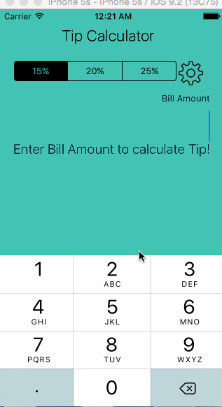

# Tip Calculator

This is a sample tip calculator application

Time spent: 2-3 hours spent in total

Completed user stories:

 * [x] Required: User can enter the total bill amount
 * [x] Required: User can check the tip to be paid
 * [x] Optional: User can select a custom tip based on slider
 * [x] Optional: The tip view hides and shows based on context

Notes:

Spent some time making the UI work across multiple phone resolutions by playing around with the RelativeLayout.

Walkthrough of all user stories:

GIF created with [LiceCap](http://www.cockos.com/licecap/).
